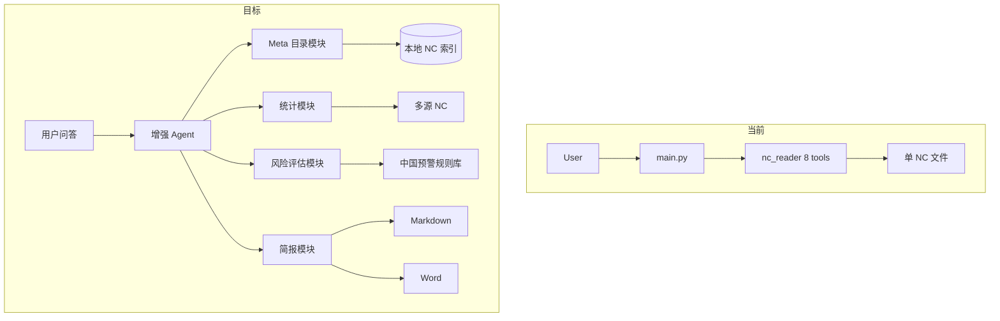
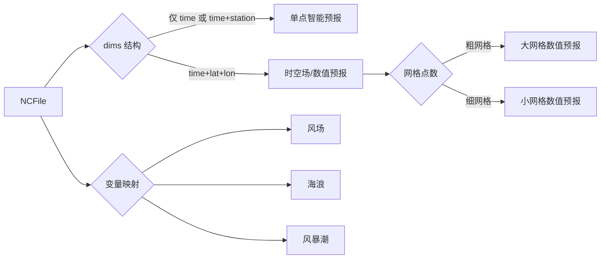
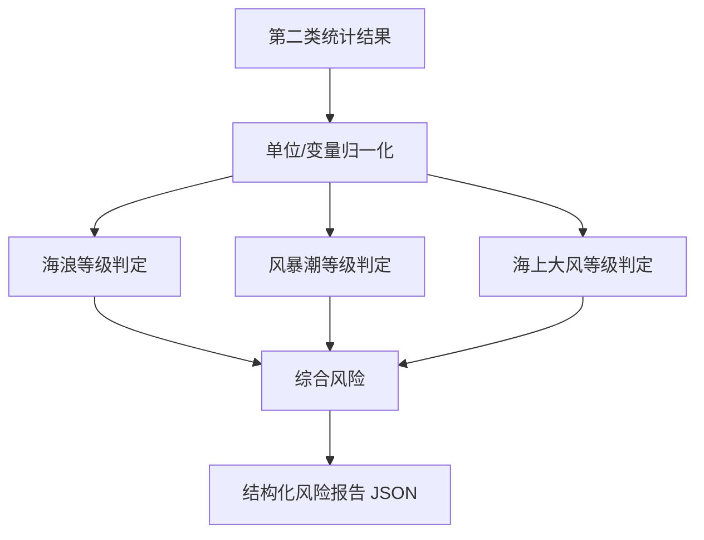

# 海洋预报 Agent 功能规划

## 现状基线

当前项目仅含 [`main.py`](main.py) 与 [`nc_reader.py`](nc_reader.py)：

- Agent 层：DeepSeek Function Calling，单轮 tool 执行 + 二次总结
- 数据层：单文件 NC 读取，8 个工具（打开/信息/点查/区域统计 mean|max|min/极值定位/时序/关闭）
- **缺口**：无多目录检索、无产品分类、无时间平均/方差、无风险等级、无简报生成；坐标名硬编码为 `latitude`/`longitude`



---

## 目标架构（建议目录）

```
Agent/
├── main.py                      # Agent 编排（多轮 tool 链、工作流引导）
├── config/
│   ├── data_roots.yaml          # 本地 NC 根目录列表
│   ├── variable_map.yaml        # 多来源变量别名（uwnd/u10/wind_u 等）
│   └── risk_rules.yaml          # 中国海洋预警阈值（可配置）
├── meta/
│   ├── scanner.py               # 递归扫描 .nc/.nc4
│   ├── classifier.py            # 产品类型识别
│   └── catalog.py               # 索引缓存 + 可用性报告
├── analysis/
│   ├── nc_reader.py             # 重构现有读取器（坐标自适应）
│   └── statistics.py            # 扩展统计（时间平均、方差等）
├── risk/
│   ├── assessor.py              # 综合风险等级判定
│   └── standards.py             # 海浪/风暴潮/海上大风规则
├── report/
│   ├── templates/
│   │   ├── briefing.md.j2       # Markdown 模板
│   │   └── briefing.docx        # Word 模板（占位符）
│   └── generator.py             # 渲染 Markdown + 填充 docx
└── requirements.txt
```

Agent 仍通过 **Function Calling** 暴露工具；业务逻辑放在各模块，LLM 负责理解意图、选工具、解读结果、组织简报语言。

---

## 第一类：NC 数据 Meta 分析

### 目标能力

用户问：「扫描 `/data/forecast` 下所有 NC，哪些可用于珠江口浪高分析？」  
Agent 应能：递归检索 → 解析头信息 → 分类 → 文字说明可用性/缺口。

### 核心功能

| 功能 | 说明 |
|------|------|
| `scan_nc_directories` | 按 [`config/data_roots.yaml`](config/data_roots.yaml) 递归扫描，支持 glob 过滤 |
| `build_nc_catalog` | 解析每个文件的 dims/vars/coords/attrs/time_range/bbox，写入 JSON 索引缓存 |
| `analyze_data_availability` | 按要素（风/浪/潮）、区域、时次、产品类型输出文字报告 |
| `get_nc_file_detail` | 单文件深度 meta（CF 属性、单位、缺测、网格类型） |

### 产品自动分类规则（[`meta/classifier.py`](meta/classifier.py)）

结合路径关键词 + 维度结构 + 变量名映射：



- **风场**：多来源并存，通过 `variable_map.yaml` 统一映射（如 `uwnd/u10/wind_speed`）
- **海浪/风暴潮**：各分三类（大/小网格数值预报、单点智能、时空场智能），分类结果写入 catalog 的 `product_type` 字段
- **可用性判定**：时间覆盖是否含目标时段、空间范围是否覆盖目标区域、变量是否存在、文件是否可读

### 文字分析报告结构（固定章节，便于 LLM 引用）

1. 扫描范围与文件总数
2. 按灾害类型 × 产品类型分组清单
3. 各组时间/空间覆盖摘要
4. 针对用户查询目标的 **可用 / 部分可用 / 不可用** 结论及原因
5. 推荐优先使用的文件列表

### 对现有代码的改动

- 从 [`nc_reader.py`](nc_reader.py) 抽出坐标解析逻辑为 `analysis/coords.py`（见第二类）
- Meta 模块 **不依赖** 打开单例 dataset，用 `xr.open_dataset(path, decode_times=False)` 轻量读取 meta

---

## 第二类：特定时空位置统计分析

### 目标能力

在 meta 选定文件后，支持自然语言指定的单点、区域、时次及统计量查询。

### 在现有工具基础上的扩展

| 已有 | 待新增 |
|------|--------|
| 单点 `extract_location_data` | 多点批量查询 |
| 区域 mean/max/min | **时间平均**、**空间平均后再时间平均**、**方差/标准差**、**分位数（P90/P95）** |
| 极值定位 `find_max_value_location` | **极小值定位**、**超过阈值格点占比** |
| 时序 `extract_point_series` | **按 datetime 选取**（非仅 index） |

### 关键重构：坐标与时间自适应（[`analysis/coords.py`](analysis/coords.py)）

解决当前硬编码问题（[`nc_reader.py`](nc_reader.py) 第 74-77、100-101 行）：

- 经纬度维：自动识别 `latitude/lat/LAT` 与 `longitude/lon/LON`
- 时间维：识别 `time/Time/T`
- 区域 slice：根据坐标递增/递减自动调整 slice 方向
- 最近邻：支持 0-360 与 -180-180 经度归一化

### 建议新增工具函数

```
extract_point_stats       # 单点：指定时间范围的 mean/max/min/std/var
extract_area_stats        # 区域：扩展 stat 枚举 + time_avg/spatial_avg
extract_extreme_events    # 极端值：阈值超越次数、持续时长
compare_sources           # 同源要素多文件对比（如风场 A vs B 偏差）
query_by_datetime         # "2024-08-15 12:00" → 最近 time index
```

### 统计结果统一 schema

所有分析工具返回：

```json
{
  "success": true,
  "query": { "location", "time_range", "variable", "stat" },
  "result": { "value", "units" },
  "metadata": { "file", "grid_point", "n_samples" }
}
```

便于第三类风险模块直接消费。

---

## 第三类：灾害风险决策

### 依据标准

按你的选择：**中国海洋预报业务规范**，实现可配置的阈值规则库（[`config/risk_rules.yaml`](config/risk_rules.yaml) + [`risk/standards.py`](risk/standards.py)）。

### 规则框架（初版覆盖三类要素）

| 要素 | 参考依据（实现为 YAML 阈值） | 输出等级 |
|------|------------------------------|----------|
| 海浪 | 《风暴潮、海浪、海冰和海啸灾害应急预案》及业务预报中的有效波高分级 | 无警 / 蓝 / 黄 / 橙 / 红 |
| 风暴潮 | 增水高度（相对天文潮或基准面）分级 | 同上 |
| 海上大风 | 平均风/阵风风速（蒲福风级换算） | 同上 |

> 初版采用 **YAML 可编辑阈值表** + 代码内注释标明国标/行业文件出处；后续你可按本单位细则微调数值，无需改代码。

### 核心工具

```
assess_sea_state          # 输入：位置 + 时间 + 统计结果 → 各要素等级
assess_comprehensive_risk # 多要素综合（取最高等级或加权规则）
assess_region_risk        # 区域统计结果 → 区域风险摘要
get_risk_criteria         # 返回当前规则说明（供 Agent 向用户解释依据）
```

### 决策流程



### 综合风险策略（默认，可配置）

- **保守策略**：多要素取最高预警等级（适合灾害简报）
- 输出包含：各要素原始值、对应等级、判定依据条文摘要、综合等级、关键建议语句（供第四类模板填充）

### 与 Agent 的配合

- 系统提示词增加：**必须先有统计数据再评估风险，不得臆造等级**
- 风险结果以结构化 JSON 存储在会话上下文，供简报模块引用

---

## 第四类：自动化简报生成

### 输出格式

- **Markdown**：Jinja2 模板 [`report/templates/briefing.md.j2`](report/templates/briefing.md.j2)，控制台预览 + 写入 `output/briefing_{timestamp}.md`
- **Word**：基于 [`report/templates/briefing.docx`](report/templates/briefing.docx) 占位符（`{{title}}`、`{{risk_summary}}` 等），用 `python-docx` 或 `docxtpl` 填充

### 简报标准章节（默认模板）

1. **标题**：时间 + 区域 + 「海洋灾害风险简报」
2. **数据来源说明**：引用的 NC 文件、产品类型、时效
3. **海况概况**：风/浪/潮关键统计值
4. **风险等级**：分要素 + 综合等级（颜色文字标注）
5. **影响分析**：对指定港口/海域的影响描述（LLM 生成，基于结构化数据）
6. **建议措施**：按等级给出防御建议（规则库内置模板句 + LLM 润色）
7. **生成时间 / 免责声明**

### 核心工具

```
generate_briefing_preview   # 仅 Markdown，快速预览
generate_briefing_docx      # 正式 Word 输出
list_briefing_templates     # 列出可用模板
```

### LLM 与模板的职责划分

| 部分 | 方式 |
|------|------|
| 数值、等级、表格 | **模板 + 结构化 JSON 填充**（确定性，可审计） |
| 影响分析、建议措辞 | **LLM 基于 JSON 润色**（可控，system prompt 限制不改动数值） |

---

## Agent 层增强（[`main.py`](main.py)）

1. **多轮 Tool 链**：while 循环直到 assistant 不再返回 tool_calls（支持 open → info → stats → risk → report 自动串联）
2. **API Key 环境变量化**：`DEEPSEEK_API_KEY`，移除硬编码
3. **系统提示词升级**：定义四类任务工作流与工具使用顺序
4. **会话上下文**：保存最近一次 catalog、统计结果、风险 JSON，供简报引用

建议工作流提示：

```
Meta 查询 → scan + catalog + availability
分析查询 → open + stats（可多次）
风险评估 → assess_*（依赖 stats 结果）
简报生成 → generate_briefing_*（依赖 risk JSON）
```

---

## 分阶段实施路线

### 阶段 1：基础架构 + Meta 分析（约 1-2 周）

- 目录重构、`requirements.txt`、`config/data_roots.yaml`
- 实现 scanner / classifier / catalog
- 注册 meta 类 tools；Agent 多轮 tool 链
- 坐标自适应重构（为后续阶段铺路）

**验收**：给定本地目录，Agent 能回答「有哪些浪高数据、时间覆盖、是否覆盖某区域」。

### 阶段 2：增强统计分析（约 1 周）

- `statistics.py` 新统计量 + datetime 查询
- 扩展 Function schema；统一返回 schema
- 多来源变量映射

**验收**：单点/区域/时间平均、方差、极端值、按 datetime 查询均可通过自然语言完成。

### 阶段 3：风险决策引擎（约 1 周）

- `risk_rules.yaml` 初版（海浪/风暴潮/大风）
- assessor 实现 + 工具注册
- 系统提示词约束「基于数据评估」

**验收**：给定统计结果，输出符合中国预警分级的结构化等级及依据说明。

### 阶段 4：简报生成（约 1 周）

- Markdown Jinja2 模板 + docx 模板
- generator 模块 + 输出目录
- LLM 润色段落与数值分离

**验收**：一键生成 `.md` 预览 + `.docx` 正式简报，数值与等级可追溯。

### 阶段 5：联调与体验优化

- 端到端场景测试（台风期间某港口风险简报）
- 错误处理：文件缺失、变量不匹配时的友好提示
- 可选：catalog 索引增量更新

---

## 依赖补充（[`requirements.txt`](requirements.txt)）

```
openai
xarray
numpy
netCDF4
pyyaml
jinja2
docxtpl          # Word 模板填充
python-docx      # docx 后处理（如需）
```

---

## 风险与待你后续确认的细节

以下不阻塞规划启动，实施阶段 3/4 前需对齐：

1. **增水基准面**：风暴潮等级依赖「增水相对什么基准」——需在 `risk_rules.yaml` 中配置 `datum`（如当地警戒潮位或平均海面）
2. **Word 模板样式**：若你有单位现有简报 Word 样例，可直接替换默认模板；否则先用通用版
3. **本地目录结构**：`data_roots.yaml` 由你填写实际路径；classifier 的路径关键词规则可根据你的文件夹命名习惯调整
4. **智能预报 NC 格式**：若单点/时空场智能预报的维度命名特殊，第一批扫描后补充 `variable_map.yaml` 映射即可

---

## 端到端示例场景（联调目标）

> 用户：「扫描 `/data/ocean` 下所有数据，分析珠江口（113-115E, 21-23N）明天 12 时的海浪和风暴潮风险，生成简报。」

Agent 执行链：

1. `scan_nc_directories` + `analyze_data_availability` → 选定浪高/增水文件
2. `open_nc_file` + `extract_area_stats` + `query_by_datetime` → 区域统计值
3. `assess_comprehensive_risk` → 蓝/黄/橙/红
4. `generate_briefing_preview` + `generate_briefing_docx` → 输出双格式简报
